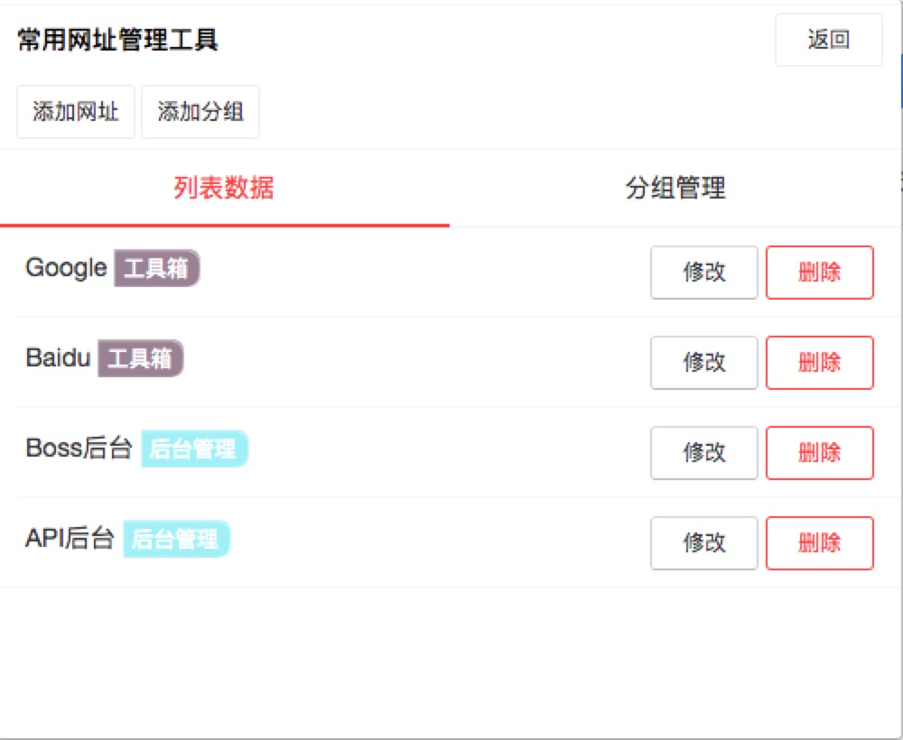
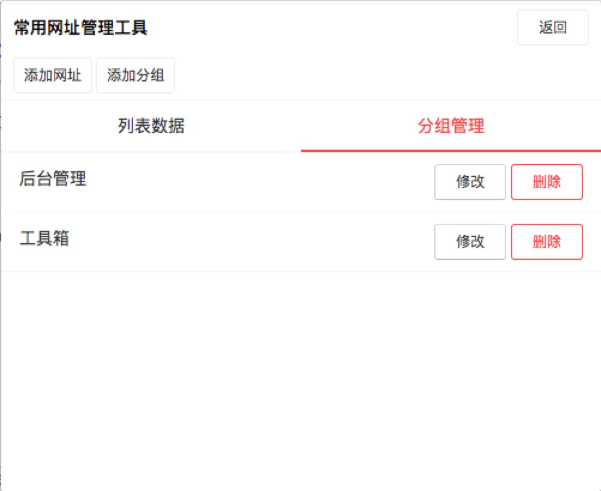

# 常用网址管理工具

## 特性
* 分组管理网站
* 动态添加分组和
* 分组可拖住排序
* 网站地址顺序可拖住排序

## 使用技术
* [Vue](https://vuejs.org/)
* [Vuex](https://vuex.vuejs.org/)
* [vant](https://github.com/youzan/vant)
* [dexie.js](http://dexie.org/)
* [Vue.Draggable](https://github.com/SortableJS/Vue.Draggable#readme)

## 截图

